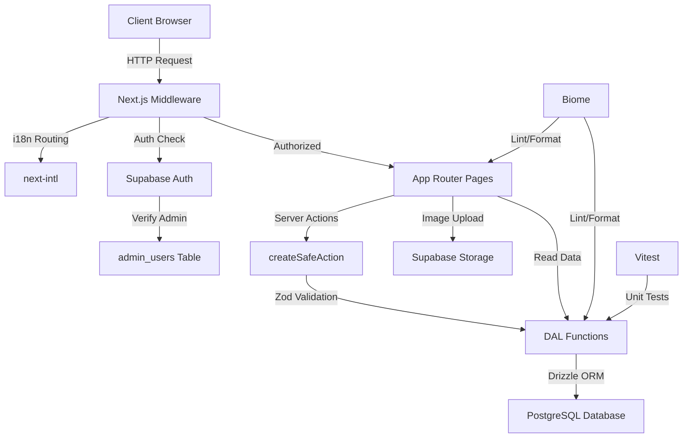

# AGENTS.md
This file provides guidance to Verdent when working with code in this repository.

## Table of Contents
1. Commonly Used Commands
2. High-Level Architecture & Structure
3. Key Rules & Constraints
4. Development Hints

## Commands

### Development
```powershell
npm run dev           # Start Next.js development server (localhost:3000)
npm run build         # Production build
npm run start         # Start production server
```

### Code Quality
```powershell
npm run lint          # Run Biome linting with auto-fix
npm run format        # Run Biome formatting with auto-fix
npm run check         # Run Biome checks only (no fixes)
```

### Testing
```powershell
npm run test          # Run Vitest tests
CI=true npm test      # Run tests once (non-interactive, for CI)
```

### Database
```powershell
npx drizzle-kit generate    # Generate migrations from schema
npx drizzle-kit migrate     # Apply migrations
npx drizzle-kit studio      # Open Drizzle Studio (DB GUI)
```

### Single Test File
```powershell
npx vitest src/dal/__tests__/apartments.test.ts
```

## Architecture

### High-Level Structure
This is a **Next.js 16 App Router** booking application with multi-language support (en, sr) for apartment rentals and local attractions.

**Core Technology Stack:**
- **Framework:** Next.js 16 + React 19 + TypeScript
- **Database:** PostgreSQL via Supabase (BaaS)
- **ORM:** Drizzle ORM
- **UI:** Tailwind CSS + Shadcn UI (Radix primitives) + Framer Motion
- **Linting/Formatting:** Biome (replaces ESLint/Prettier)
- **Forms:** React Hook Form + Zod validation
- **i18n:** next-intl
- **Auth:** Supabase Auth (JWT-based)

### Directory Structure
```
src/
├── app/[locale]/          # Next.js App Router pages (i18n routes)
├── features/              # Feature-specific components & actions
│   ├── admin/            # Admin management (users, invites)
│   ├── attractions/      # Attraction mutations
│   ├── booking/          # Booking calendar & forms
│   ├── landing/          # Landing page sections
│   └── listings/         # Apartment listings
├── dal/                   # DATA ACCESS LAYER - ALL database queries
│   ├── apartments.ts
│   ├── attractions.ts
│   ├── bookings.ts
│   └── users.ts
├── db/                    # Database config & schema
│   ├── index.ts          # Drizzle instance
│   └── schema.ts         # Table definitions
├── components/            # Shared UI components
│   ├── ui/               # Shadcn UI components
│   ├── admin/            # Admin-specific components
│   ├── layout/           # Footer, Navbar, LanguageSwitcher
│   └── shared/           # FormInput, RichTextEditor, etc.
├── lib/                   # Utilities & libraries
│   ├── auth*.ts          # Auth utilities (client/server/admin)
│   ├── safe-action.ts    # Server Action wrapper
│   ├── supabase*.ts      # Supabase clients
│   └── types.ts          # Shared type definitions
├── i18n/                  # Internationalization config
└── middleware.ts          # Next.js middleware (i18n + auth)
```

### Major Subsystems

1. **Public Booking System**
   - Browse apartment listings (`/listings`)
   - View apartment details (`/apartment/[id]`)
   - Submit booking requests via forms
   - Explore local attractions (`/attraction/[id]`)

2. **Admin Dashboard** (`/admin/dashboard`)
   - Protected by middleware (JWT + DB role check)
   - Manage apartments, bookings, attractions, users
   - Upload images to Supabase Storage
   - Session timeout enforcement

3. **Data Access Layer (DAL)**
   - All database queries isolated in `src/dal/`
   - Uses Drizzle ORM with type-safe query builder
   - Mocked in unit tests via `vitest-mock-extended`

4. **Authentication & Authorization**
   - Supabase Auth (email/password)
   - Middleware validates JWT + checks `admin_users` table
   - Fallback to env var admin emails during migration

### Request/Response Lifecycle

**Public Page Request:**
```
User → middleware.ts → i18n routing → [locale]/page.tsx → DAL functions → PostgreSQL
                    ↓
              Supabase Auth (optional)
```

**Admin Page Request:**
```
User → middleware.ts → Check JWT → Query admin_users table → Authorized route
                    ↓                    ↓
              Redirect to login    OR   Redirect to home (if not admin)
```

**Form Submission (Server Action):**
```
Client form → Server Action (wrapped in createSafeAction) → Zod validation
                                                          ↓
                                          DAL function → PostgreSQL
                                                          ↓
                                          Return ActionState<T>
```

### External Dependencies
- **Supabase:** Database (PostgreSQL), Auth, and Storage
- **Leaflet/OpenStreetMap:** Map rendering for apartment/attraction locations
- **Unsplash:** Demo images (allowed in `next.config.ts`)

### Development Entry Points
- **Landing Page:** `src/app/[locale]/page.tsx`
- **Admin Login:** `src/app/[locale]/admin/login/page.tsx`
- **Middleware:** `src/middleware.ts` (runs on every request)

### Subsystem Relationships



## Key Rules & Constraints

### From GEMINI.md & conductor/

1. **Data Access Layer (CRITICAL):**
   - **ALL database queries MUST be in `src/dal/`**
   - NEVER call Drizzle directly in components or Server Actions
   - DAL functions should be pure query logic with no business logic

2. **Server Actions:**
   - ALL mutations MUST use `createSafeAction` from `src/lib/safe-action.ts`
   - Return type: `ActionState<T>` with `success`, `data`, `message`, `errors`
   - Input validation via Zod schemas

3. **Biome (NOT ESLint/Prettier):**
   - Run `npm run lint` before committing
   - Biome enforces formatting, linting, and type checking
   - Configuration: `biome.json`

4. **TypeScript Style (Google TypeScript Style Guide):**
   - Use `const` or `let` (NEVER `var`)
   - Named exports only (NO default exports)
   - Use `private` modifier, NOT `#private` fields
   - NEVER use `public` modifier (it's default)
   - Avoid `any` type (use `unknown` or specific types)
   - Avoid type assertions (`as`, `!`) without justification
   - Use `===` and `!==` (NEVER `==` or `!=`)
   - Explicit semicolons (do NOT rely on ASI)
   - Single quotes for strings, template literals for interpolation
   - `UpperCamelCase` for types/classes, `lowerCamelCase` for variables/functions

5. **Forms & Validation:**
   - Use React Hook Form + Zod for all forms
   - Zod schemas define both validation AND types
   - Use `@hookform/resolvers` for integration

6. **Internationalization:**
   - ALL user-facing text MUST use `next-intl`
   - Translation files: `messages/en.json`, `messages/sr.json`
   - Add both English and Serbian translations for new features

7. **Environment Variables:**
   - Access env vars ONLY via `src/env.ts` (Zod-validated)
   - NEVER use `process.env` directly in code

8. **Images:**
   - Upload to Supabase Storage bucket
   - Use `next/image` component with optimized formats (WebP, AVIF)
   - Remote patterns configured in `next.config.ts`

9. **Testing Requirements:**
   - Unit tests for ALL DAL functions (`src/dal/__tests__/`)
   - Target: >80% code coverage
   - Use Vitest with `vitest-mock-extended` for mocking Drizzle

10. **Security Headers:**
    - Configured in `next.config.ts`
    - X-Frame-Options: DENY
    - X-Content-Type-Options: nosniff
    - Strict-Transport-Security enabled

11. **Git Commit Format:**
    ```
    <type>(<scope>): <description>
    
    Types: feat, fix, docs, style, refactor, test, chore, conductor
    ```

12. **TDD Workflow (from conductor/workflow.md):**
    - Write failing tests FIRST (Red phase)
    - Implement code to pass tests (Green phase)
    - Refactor with passing tests as safety net
    - Mark tasks in `plan.md` with `[~]` (in progress) → `[x]` (complete) + commit SHA

13. **Current Modernization Track:**
    - Focus: Align with "Context7" patterns
    - Eliminate direct database calls in components
    - Ensure all Server Actions use `createSafeAction`
    - Remove `any` types, enforce strict type safety

## Development Hints

### Adding a New API Endpoint (Server Action)

1. **Create Zod schema** in the feature's `actions.ts`:
   ```typescript
   const MyActionSchema = z.object({
     name: z.string().min(1),
     email: z.string().email(),
   });
   ```

2. **Add DAL function** in `src/dal/<resource>.ts`:
   ```typescript
   export async function createResource(data: { name: string; email: string }) {
     return db.insert(resources).values(data).returning();
   }
   ```

3. **Create Server Action** using `createSafeAction`:
   ```typescript
   export const myAction = createSafeAction(
     MyActionSchema,
     async (data) => {
       const result = await createResource(data);
       return result[0];
     }
   );
   ```

4. **Write unit tests** in `src/dal/__tests__/<resource>.test.ts`

### Modifying the Database Schema

1. Edit `src/db/schema.ts`
2. Run `npx drizzle-kit generate` to create migration
3. Review migration in `supabase/migrations/`
4. Apply with `npx drizzle-kit migrate`
5. Update DAL functions and types accordingly

### Adding a New Admin Feature

1. Check middleware protection in `src/middleware.ts`
2. Create feature in `src/features/admin/`
3. Add DAL functions in `src/dal/`
4. Create Server Actions with `createSafeAction`
5. Add page in `src/app/[locale]/admin/`
6. Add translations in `messages/en.json` and `messages/sr.json`

### Adding a New Shadcn UI Component

```powershell
npx shadcn@latest add <component-name>
```

Component will be added to `src/components/ui/`

### Debugging Authentication Issues

1. Check middleware logs for JWT validation
2. Verify `admin_users` table has correct `user_id` and `role`
3. Fallback check: User email in `NEXT_PUBLIC_ADMIN_EMAIL_1` or `_2`
4. Test Supabase client initialization in `src/lib/supabase-server.ts`

### Image Upload Flow

1. Client uploads via `ImageUpload.tsx` component
2. Files sent to `src/lib/image-upload.ts`
3. Uploaded to Supabase Storage bucket
4. Public URL stored in `apartment_images` or `attraction_images` table
5. Displayed via `OptimizedImage.tsx` wrapper

### Extending i18n Support

1. Add new locale to `src/i18n/routing.ts`
2. Create `messages/<locale>.json` with translations
3. Update middleware matcher in `src/middleware.ts` config
4. Add locale to type definitions in `src/i18n/types.ts`
